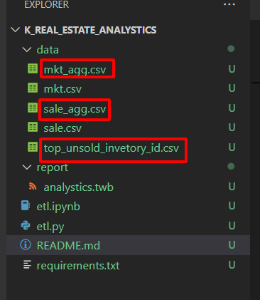
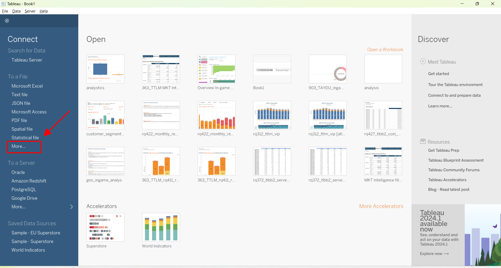
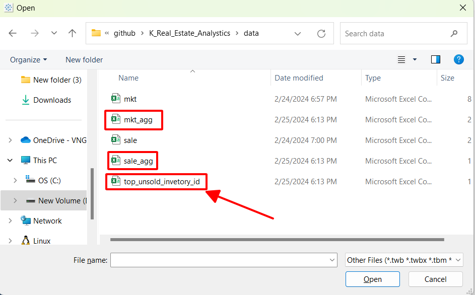

# K real estate compauny - Bussiness Analystics Project

## Table of Contents
- [Problem](#problem)
- [System Components](#system-components)
- [What You'll Learn](#what-youll-learn)
- [Technologies](#technologies)
- [Walkthrough](#walkthrough)

## Problem
Assignment: Analyze the provided dataset containing hypothetical inventories of a real-estate company called ABC.

Objectives:
 - Choose 3 most crucial metrics you can calculate from the data and analyze, calculate, and visualize them using appropriate graphs (showing progress over time).
 - Provide recommendations for ABC based on your findings to help them sell inventories faster

Deliverable:
 - A report outlining the above points
 
## System Components
- **data** folder: Raw data for the project

- **etl.py**: This code snippet processes raw data into aggregated data for analysis (You can also check the ipynb version for implementation).

- **report**: This folder contains my personal report templates.

## What You'll Learn
- Data processing using Python and sql packages
- Visualizing data using Tableau
- Writing a diagnostic analysis report

## Technologies
- Python
- Tableau

## Walkthrough

1. Download the code and prepare the data for analysing

- Clone this respository
    ```bash
    git clone https://github.com/hauct/K_Real_Estate_Analystics.git
    ``` 

- Run this code in your terminal
    ```bash
    pip install -r requirements.txt
    run etl.py
    ```

- Make sure you have 3 new files: `mkt_agg.csv`, `sale_agg.csv`, `top_unsold_inventory_id.csv`, which is needed to load into your visualize tool




2. Install Tableau and do reporting
- I strongly recommend you [Tableau](https://www.tableau.com/products/trial) to visualize our data. It will give you 14 days-trial after finishing your registration

- Open your Tableau, and import the new 3 file csv into this tool

|                                                |                                                |
|------------------------------------------------|------------------------------------------------|
|||

- Based on my analysis, I believe the following three metrics are most crucial for evaluating the company's business performance:

1. `Profit`:
Calculated as `selling_price - (buying_price + cost)`.
Measures the profit generated by each inventory item.

2. `Average Days on Market`:
Calculated as `date_sold - date_acquired`.
Indicates the average number of days an inventory item remains unsold before being sold.

3. `Unsold Quantity`:
Represents the number of inventory items that remain unsold.

For a more in-depth analysis, please refer to my [analytics.twb](report/analystics.twb) story in the `report` folder.

And this is the end of my project. Thanks for reading.